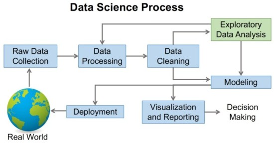
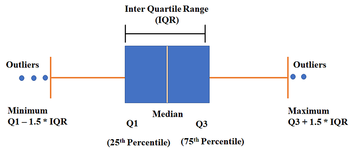
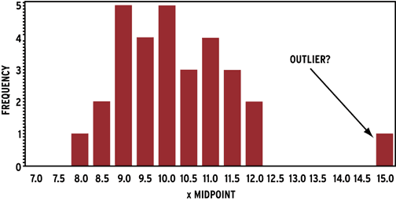
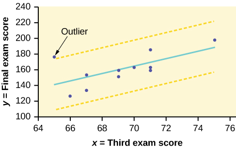
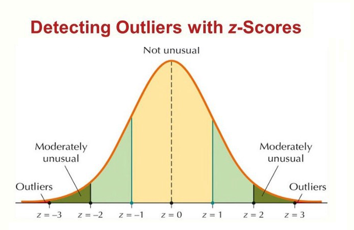

# Exploratory Data Analysis (EDA)

1. What is Exploratory Data analysis?  Why EDA is important?
2. Visualization
    - Important charts for visualization.
3. Steps involved in EDA:-
    - Data Sourcing
    - Data Cleaning
    - Univariate analysis with visualization
    - Bivariate analysis with visualization
    - Derived Metrics
4. Use Cases

# 1. What is Exploratory Data Analysis? 
   And Why EDA is important?

- Exploratory Data Analysis is an approach to analyze the datasets to summarize their main characteristics in form of visual methods.
- EDA is nothing but a data exploration technique to understand various aspects of the data.
- The main aim of EDA is to obtain confidence in a data to an extent where we are ready to engage a machine learning model.
- EDA is important to analyze the data it’s a first steps in data analysis process.
- EDA give a basic idea to understand the data and makes sense of the data to figure out the question you need to ask and find out the best way to manipulate the dataset to get the answer to your question.
- Exploratory data analysis help us to finding the errors, discovering data, mapping out data structure, finding out anomalies.
- Exploratory data analysis is important for business process because we are preparing dataset for deep thorough analysis that will detect your business problem.
- EDA help to build a quick and dirty model, or a baseline model, which can serve as a comparison against later models that you will build.
    
    
    

# 2. Visualization

.png)

# 3. Steps involved in EDA:-

.png)

## 1. Data Sourcing

- Data Sourcing is the process of gathering data from multiple sources as external or internal data collection.
- There are two major kind of data which can be classified according to the source:
    1. Public data
    2. Private data
- **Public Data**
    - The data which is easy to access without taking any permission from the agencies is culled public data. The agencies made the data public for the purpose of the research.
    - Example: government and other public sector or ecommerce sites made the data public.
- **Private Data**
    - Private Data:- The data which is not available on public platform and to access the data we have to take the permission of organisation is called private data.
    - Example: Banking, telecom, retail sector or there which not made their data publicly available.

### Structure of Data and EDA Usage In Organisation

- **Multinational Corporation (MNC)**
    - *Data Structure*: Grand digital metropolis with structured data (ERP, HR, CRM) from public APIs and private telecoms, governed centrally.
    - *EDA Usage*: Master strategists use line charts for revenue trends, scatter plots for supply chain anomalies, and baseline models for market shifts (e.g., Asian sales dip).
- **Midlevel Company**
    - *Data Structure*: Bustling town square with hybrid data (ecommerce public, client private) in cloud CRMs and spreadsheets.
    - *EDA Usage*: Local artisans use bar charts for sales, histograms for feedback, and correlations for marketing insights (e.g., weekend telecom surge).
- **Startup**
    - *Data Structure*: Vibrant loft with chaotic data (app analytics, notes, social media) in evolving Google Sheets.
    - *EDA Usage*: Creative muse uses pie charts for features, line graphs for sign-ups, and outlier hunts for pivots (e.g., bug fix from comments).

## 2. Data Cleaning

- After collecting the data, the next step is data cleaning. Data cleaning means that you get rid of any information that doesn't need to be there and clean up by mistake.
- Data Cleaning is the process of clean the data to improve the quality of the data for further data analysis and building a machine learning model.
- The benefit of data cleaning is that all the incorrect and irrelevant data is gone, and we get the good quality of data which will help in improving the accuracy of our machine learning model.
- The following are some steps involve in Data Cleaning
    1. Handle Missing Values
    2. Feature Scaling 
    3. Outlier Treatment
    4. Standardization of the data
    5. Handle Invalid values

### 1. Handle Missing Values

- **Delete Rows/Columns**
    - This method we commonly used to handle missing values. Rows can be deleted if it has insignificant number of missing value Columns can be delete if it has more than 75% of missing value.
- **Replacing with mean/median/mode method**
    - This method can be used on independent variable when it has numerical variables. On categorical feature we apply mode method to fill the missing value.
- **Algorithm Imputation**
    - Some machine learning algorithm supports to handle missing value in the datasets. Like KNN, Naive Bayes, Random forest.
- **Predicting the missing values**
    - Prediction model is one of the advanced method to handle missing values. In this method dataset with no missing value become training set and dataset with missing value become the test set and the missing values is treated as target variable.

### 2. Feature Scaling

Feature scaling is the method to rescale the values present in the features. In feature scaling we convert the scale of different measurement into a single scale. It standardize the whole dataset in one range.

---

**Importance of Feature Scaling**

When we are dealing with independent variable or features that differ from each other in terms of range of values or units of the features, then we have to normalize/standardize the data so that the difference in range of values doesn’t affect the outcome of the data.

---

| Person | Weight | Height |
| --- | --- | --- |
| A | 85 | 170 |
| B | 80 | 165 |
| C | 75 | 168 |
| D | 70 | 170 |

Add extra features using scaling

- A = Weight (Highest)
- D = Weight (Lowest)
- A and D  = Height (Highest)
- B = Height (Lowest)

| Person | Weight | W_FS | Height | H_FS |
| --- | --- | --- | --- | --- |
| A | 85 | 85/85 = 1 | 170 | 170/170 = 1 |
| B | 80 | 80/85= 0.95 | 165 | 165/170 = 0.95 |
| C | 75 | 75/85 = 0.88 | 168 | 168/170 = 0.98 |
| D | 70 | 70/85 = 0.82 | 170 | 170/170 = 1 |

.png)

**How feature scaling affects the actual values**, here’s a breakdown with **examples** using raw values and how they change after applying different **scaling techniques**.

---

### Suppose we have a single feature:

```
Original values: [10, 20, 30, 40, 50]

```

---

### 1. **Min-Max Scaling** (Range: 0 to 1)

Formula:

x′=x−xmin⁡xmax⁡−xmin⁡x' = \frac{x - x_{\min}}{x_{\max} - x_{\min}}

$$
x′ = \frac{x - x_{\min}}{x_{\max} - x_{\min}}
$$

**Calculation:**

- Min = 10, Max = 50

$$
[ \frac{10-10}{40}, \frac{20-10}{40}, \frac{30-10}{40}, \frac{40-10}{40}, \frac{50-10}{40} ] = [0, 0.25, 0.5, 0.75, 1]
]
$$

➡️ **Scaled values:** `[0.0, 0.25, 0.5, 0.75, 1.0]`

---

### 2. **Standardization (Z-score Scaling)**

Formula:

$$
x′ = \frac{x - \mu}{\sigma}
$$

**Calculation:**

- Mean (μ) = 30
- Standard Deviation (σ) ≈ 15.81

$$
[ \frac{10-30}{15.81}, \frac{20-30}{15.81}, ..., \frac{50-30}{15.81} ] ≈ [-1.26, -0.63, 0.0, 0.63, 1.26]
$$

➡️ **Scaled values:** `[-1.26, -0.63, 0.0, 0.63, 1.26]`

---

### 3. **Robust Scaling** (uses median and IQR)

Formula:

$$
x′ = \frac{x - \text{median}}{\text{IQR}}
$$

**Calculation:**

- Median = 30
- IQR = Q3 - Q1 = 45 - 15 = 30

$$
[ \frac{10-30}{30}, \frac{20-30}{30}, ..., \frac{50-30}{30} ] = [-0.67, -0.33, 0, 0.33, 0.67]
$$

➡️ **Scaled values:** `[-0.67, -0.33, 0.0, 0.33, 0.67]`

---

### 4. **MaxAbs Scaling**

Formula:

$$
x′= \frac{x}{|x_{\max}|}
$$

**Calculation:**

- Max = 50

$$
[10/50,20/50,30/50,40/50,50/50]= [0.2, 0.4, 0.6, 0.8, 1.0]
$$

➡️ **Scaled values:** `[0.2, 0.4, 0.6, 0.8, 1.0]`

---

### ✅ Summary Table

| Original | MinMax | Standard | Robust | MaxAbs |
| --- | --- | --- | --- | --- |
| 10 | 0.0 | -1.26 | -0.67 | 0.2 |
| 20 | 0.25 | -0.63 | -0.33 | 0.4 |
| 30 | 0.5 | 0.0 | 0.0 | 0.6 |
| 40 | 0.75 | 0.63 | 0.33 | 0.8 |
| 50 | 1.0 | 1.26 | 0.67 | 1.0 |

---

.png)

.png)

### 3.Outlier Treatment

.png)

1. Boxplot Outliers
    
    
    
2. Histogram Outliers
    
    
    
3. Scatter plot Outliers
    
    
    
4. Z-score Outliers
    
    
    
    A normal distribution is shown below and it is


    
    - It is estimated that 68% of the data points lie between +/- 1 standard deviation.
    - 95% of the data points lie between +/- 2 standard deviations.
    - 99.7% of the data points lie between +/- 3 standard deviations.
    
    Z score and Outliers: If the Z score of a data point is more than 3, it indicates that the data point is quite different from the othe2r data points. Such a data point can be an outlier. For example, in a survey, it was asked how many children a person had. Suppose the data obtained from people.


For more Notes content visit https://techyadarsh.in/
